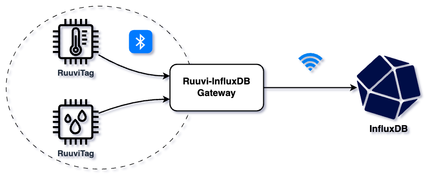

# Ruuvi-InfluxDB Gateway

[](https://github.com/iiroki/ruuvi-influxdb-gw/actions/workflows/unit-tests.yml)

**_Ruuvi-InfluxDB Gateway_** is a simple gateway to collect data from RuuviTags and send them to InfluxDB implemented with TypeScript and Node.js.



**Features:**
- Collect data from RuuviTags
- Transform Ruuvi data to InfluxDB-compatible format
- Send data to InfluxDB
- Various configuration options (see [Configuration](#configuration))

**Supported Ruuvi data formats:**
- [Data format 5](https://docs.ruuvi.com/communication/bluetooth-advertisements/data-format-5-rawv2)
- [Data format 3](https://docs.ruuvi.com/communication/bluetooth-advertisements/data-format-3-rawv1)
- Acceleration
- Battery

## Quickstart

**Prerequisites:**
- [Node.js](https://nodejs.org/en/)
- [PM2](https://pm2.keymetrics.io/) (OPTIONAL FOR "PRODUCTION")

### Development

1. Install npm dependencies:
    ```bash
    npm i
    ```

2. Create a JSON configuration file and enter InfluxDB configuration.
    - See [Configuration](#configuration) for more information.

3. Build and start the gateway in development mode (prettier logging):
    ```bash
    npm run dev
    ```

### Production

In "production", PM2 is used to run the gateway as a daemon.
The configuration is handled the same way as in development mode.

1. Install npm production dependencies:
    ```bash
    npm run build:prod
    ```

2. Start the gateway with PM2:
    ```bash
    pm2 start npm --name 'ruuvi-influxdb-gw' -- start
    ```

3. (OPTIONAL) Check that the gateway is running:
    ```bash
    pm2 list
    ```

## Data flow

When the gateway receives data from RuuviTags, it transforms the data to InfluxDB data points using the following rules ([RuuviInfluxTransform](./src//stream.ts)):
- **Tags:**
    - Default tags from the configuration
    - `host`: Operating system host name
    - `btPeripheralId`: RuuviTag Bluetooth peripheral ID
    - `btPeripheralName`: RuuviTag Bluetooth peripheral local name
    - `id`: RuuviTag ID
    - `mac`: RuuviTag MAC
    - `dataFormat`: RuuviTag data format
- **Fields:** All the other values included in RuuviTag advertisement broadcasts.
- **Timestamp:** Timestamp when [`BluetoothManager`](./src/bluetooth.ts) received the data
- **Measurement:** Measurement name from the configuration

## Configuration

By default, configuration is read from `config.json` in the root directory.
This can be changed by setting the `CONFIG_PATH` env variable.

**Configuration options:**
| Config | Key | Description | Type | Required |
| --- | --- | --- | --- | :---: |
| `bluetooth` | - | Bluetooth/Ruuvi configuration | See below | &cross; |
| `bluetooth` | `serviceUuids` | Bluetooth service UUIDs to scan for | `string[]` | &cross; |
| `influx` | - | InfluxDB configuration | See below | &check; |
| `influx` | `url` | Database URL | `string` | &check; |
| `influx` | `token` | API token | `string` | &check; |
| `influx` | `bucket` | Bucket | `string` | &check; |
| `influx` | `org` | Organization | `string` | &check; |
| `influx` | `measurement` | Measurement  | `string` | &check; |
| `influx` | `defaultTags` | Tags to be included with every data point  | `Record<string, string>` | &cross; |
| `influx` | `batchSize` | Max number of data points in a batch | `number` | &cross; |
| `influx` | `flushIntervalMs` | Interval between forceful data flushes (ms) | `number` | &cross; |
| `influx` | `gzipThreshold` | Batches larger than the value will be gzipped | `number` | &cross; |

**Example config:**

```json
{
  "bluetooth": {
    "serviceUuids": ["fe9a"]
  },
  "influx": {
    "url": "http://localhost:8086",
    "token": "influx-token",
    "bucket": "influx-bucket",
    "org": "influx-org",
    "measurement": "ruuvi",
    "defaultTags": {
      "customTag": "customValue"
    },
    "batchSize": 10,
    "flushIntervalMs": 1000,
    "gzipThreshold": 1024
  },
  "cacheIntervalMs": 5000
}
```

## License

**MIT License** Copyright (c) 2023 Iiro Kiviluoma

### Other Licenses

[Ruuvi](https://ruuvi.com/) / Ojousima: BSD 3-Clause License
