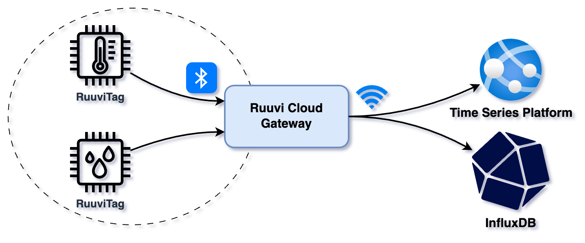

# Ruuvi Cloud Gateway

[](https://github.com/iiroki/ruuvi-cloud-gw/actions/workflows/unit-tests.yml)

**_Ruuvi Cloud Gateway_** is a simple gateway implemented with TypeScript and Node.js that
collects data from RuuviTags and send them to various cloud outputs.



**Features:**
- Collect data from RuuviTags
- Transform Ruuvi data to InfluxDB-compatible format
- Send data to cloud:
    - [Time Series Platform](https://github.com/iiroki/time-series-platform) (my personal time series storage)
    - [InfluxDB](https://www.influxdata.com/)
- Various configuration options (see [Configuration](#configuration))

**Supported RuuviTag data formats:**
- [Data format 5](https://docs.ruuvi.com/communication/bluetooth-advertisements/data-format-5-rawv2)
- [Data format 3](https://docs.ruuvi.com/communication/bluetooth-advertisements/data-format-3-rawv1)

## Quickstart

### Development

1. Install npm dependencies:
    ```bash
    npm i
    ```

2. Create a JSON configuration file and enter InfluxDB configuration.
    - See [Configuration](#configuration) for more information.

3. Build and start the gateway in development mode (prettier logging):
    ```bash
    npm run dev
    ```

### Production

In "production", [**PM2**](https://pm2.keymetrics.io/) is can be used to run the gateway as a daemon.
The configuration is handled the same way as in development mode.

1. Install npm production dependencies:
    ```bash
    npm run build:prod
    ```

2. Start the gateway with PM2:
    ```bash
    pm2 start npm --name 'ruuvi-cloud-gw' -- start
    ```

3. (OPTIONAL) Check that the gateway is running:
    ```bash
    pm2 ls
    ```

## Data flow

When RuuviTag data is received, it's streamed into all defined outputs.

### Time Series Platform

TODO: Documentation

### InfluxDB

When the gateway receives data from RuuviTags, it transforms the data to InfluxDB data points using the following rules ([RuuviInfluxTransform](./src/output/influx.ts)):
- **Tags:**
    - Default tags from the configuration
    - `btGatewayHost`: Operating system host name
    - `btGatewayHostPlatform`: Operating system platform
    - `btPeripheralId`: RuuviTag Bluetooth peripheral ID
    - `btPeripheralName`: RuuviTag Bluetooth peripheral local name
    - `id`: RuuviTag ID
    - `mac`: RuuviTag MAC
    - `dataFormat`: RuuviTag data format
- **Fields:** All the other values included in RuuviTag advertisement broadcasts.
- **Timestamp:** Timestamp when [`RuuviTagListener`](./src/ruuvi/bluetooth.ts) received the data
- **Measurement:** Measurement name from the configuration.

## Configuration

By default, configuration is read from `config.json` in the root directory.

**Env:**
- `CONFIG_PATH`: Override default path to the configuration file.
- `LOG_LEVEL`: [Pino log level](https://github.com/pinojs/pino/blob/master/docs/api.md#logger-level), default = `info`.

**Configuration:**
| Key | Description | Type | Required |
| --- | --- | --- | :---: |
| `ruuvi` | Ruuvi/Bluetooth configuration | `RuuviConfig` | - |
| `outputs` | Output configuration | `{ "tsp": TspConfig, "influx": InfluxConfig }` | - |

**`RuuviConfig`:**
| Key | Description | Type | Required |
| --- | --- | --- | :---: |
| `scanMode` | Whether to start the bluetooth service in scan-only mode | `boolean` | - |
| `serviceUuids` | Bluetooth service UUIDs to scan for | `string[]` | - |
| `filters` | Filter which RuuviTags data should be collected from | `RuuviTagIdentifier[]` | - |
| `logMissedSequences` | Generate warning logs from the missed RuuviTag sequences | `boolean` | - |

**`RuuviTagIdentifier`:**
| Key | Description | Type | Required |
| --- | --- | --- | :---: |
| `type` | Type of the identifying property | `id` or `name` | &check; |
| `value` | Identifier value | `string` | &check; |

**`TspConfig`:**
| Key | Description | Type | Required |
| --- | --- | --- | :---: |
| `url` | URL | `string` | &check; |
| `apiKey` | API key | `string` | &check; |
| `apiKey` | API key header | `string` | - |
| `intervalMs` | Interval between sending batches | `number` | - |
| `bindings` | Ruuvi -> TSP bindings | `TspRuuviBindingConfig` | &check; |

**`TspRuuviBindingConfig`:**
| Key | Description | Type | Required |
| --- | --- | --- | :---: |
| `tags` | Collected tags/measurements | `TspRuuviBindingTagConfig[]` | &check; |
| `locations` | Locations associated with RuuviTags | `TspRuuviBindingLocationConfig[]` | - |

**`TspRuuviBindingTagConfig`:**
| Key | Description | Type | Required |
| --- | --- | --- | :---: |
| `in` | RuuviTag input field name associated with the output tag | `string` | &check; |
| `out` | TSP tag slug | `string` | &check; |

**`TspRuuviBindingLocationConfig`:**
| Key | Description | Type | Required |
| --- | --- | --- | :---: |
| `in` | RuuviTag associated with the output location | `RuuviTagIdentifier` | &check; |
| `out` | TSP location slug | `string` | &check; |

**`InfluxConfig`:**
| Key | Description | Type | Required |
| --- | --- | --- | :---: |
| `url` | Database URL | `string` | &check; |
| `token` | API token | `string` | &check; |
| `bucket` | Bucket | `string` | &check; |
| `org` | Organization | `string` | &check; |
| `measurement` | Measurement  | `string` | &check; |
| `defaultTags` | Tags to be included with every data point  | `Record<string, string>` | &cross; |
| `batchSize` | Max number of data points in a batch | `number` | &cross; |
| `flushIntervalMs` | Interval between forceful data flushes (ms) | `number` | &cross; |
| `gzipThreshold` | Batches larger than the value will be gzipped | `number` | &cross; |

**Example config:**

```json
{
  "ruuvi": {
    "serviceUuids": ["fe9a"],
    "scanMode": false,
    "filters": [
        { "type": "name", "value": "Ruuvi Foo" },
        { "type": "name", "value": "Ruuvi Bar" }
    ]
  },
  "outputs": {
    "tsp": {
      "url": "$TSP_URL",
      "apiKey": "$TSP_API_KEY",
      "bindings": {
        "tags": [
          { "in": "temperatureC", "out": "temperature" },
          { "in": "humidityRh", "out": "humidity" }
        ],
        "locations": [
          {
            "in": { "type": "name", "value": "Ruuvi Foo" },
            "out": "home-living-room"
          },
          {
            "in": { "type": "name", "value": "Ruuvi Bar" },
            "out": "home-bedroom"
          }
        ]
      }
    },
    "influx": {
      "url": "$INFLUX_URL",
      "token": "$INFLUX_TOKEN",
      "bucket": "influx-bucket",
      "org": "influx-org",
      "measurement": "ruuvi",
      "defaultTags": {
        "customTag": "customValue"
      },
      "batchSize": 10,
      "flushIntervalMs": 1000,
      "gzipThreshold": 1024
    }
  }
}
```
